# 개발 환경 설정

[React Native Environment setup]: https://reactnative.dev/docs/environment-setup


## Android Setting

### Node

- 설치 버전 확인

  - ```
    node -v
    npm -v
    ```

  - 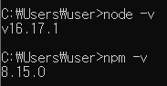


### JDK

- https://www.oracle.com/java/technologies/downloads/#java11-windows
- 환경변수 설정
  - 내 PC > 우클릭 속성 > 고급 시스템 설정
    - 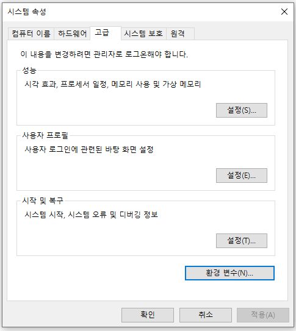
  
  - 시스템 변수 추가
  
    - 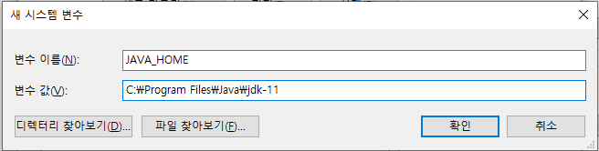
  
  - path에 `%JAVA_HOME%\bin;`추가
  
  - 설치 버전 확인
  
    - ```
      java -version
      ```
  
    - 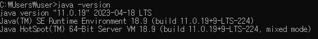
  
    

### React Native CLI

- `npm install -g react-native-cli`

- 설치 버전 확인

  - ```
    react-native -v
    ```

  - 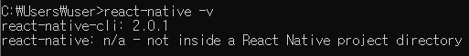


### Android Studio

- https://developer.android.com/studio/index.html
- 설치 마법사에서 아래 사항 모두 체크
  - Android SDK
  - Android SDK Platform
  - Android Virtual Device
  
- 환경 변수 설정

  - 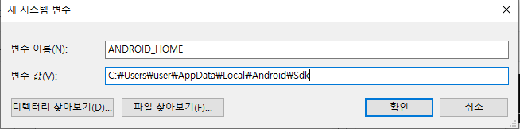
  - 변수 값인 Sdk 저장 위치 확인
    - Android Studio > File > Settings > Appearance & Behavior > System Settings > Android SDK
    - 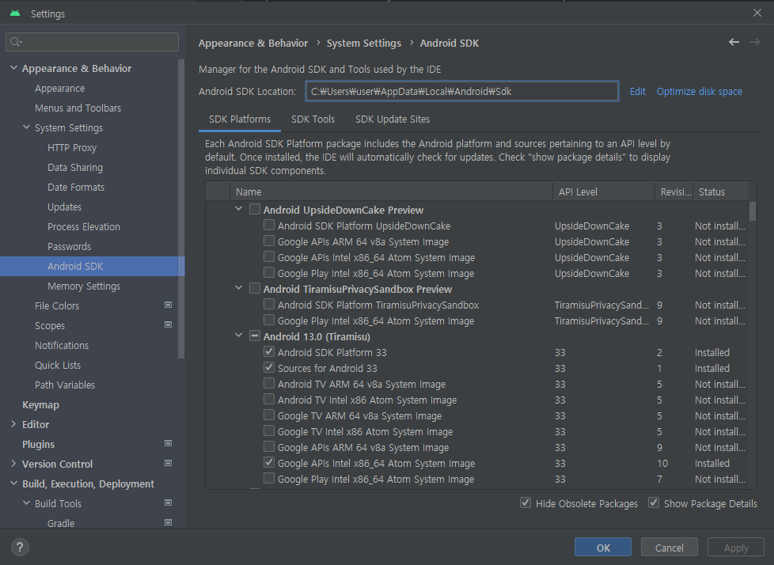
  - 사용자 변수 path에 `% ANDROID_HOME%\platform-tools`추가

- 설치 버전 확인

  - ```
    adb --version
    ```

  - 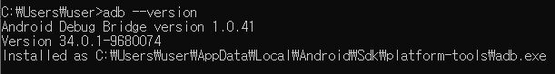


## Web Setting

- npm 패키지 설치

  - ```
    npm install --save react-dom
    npm install --save-dev @babel/core babel-loader @babel/preset-react
    npm install --save-dev webpack webpack-cli webpack-dev-server html-webpack-plugin
    ```

- 파일 구조

  - 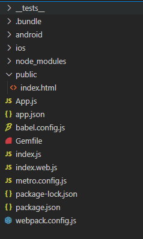

- package.json script 부분 수정

  - ```
    "scripts": {
        "android": "react-native run-android",
        "ios": "react-native run-ios",
        "start": "react-native start",
        "build-react": "webpack --mode production",
        "start-react": "webpack serve --config ./webpack.config.js --mode development",
        "test": "jest",
        "lint": "eslint ."
      },
    ```

- root에 webpack.config.js만들고 아래 코드 추가 

  - https://webpack.kr/configuration/dev-server/#devserverhot

  - ```
    const path = require('path');
    const HTMLWebpackPlugin = require('html-webpack-plugin');
    
    const HTMLWebpackPluginConfig = new HTMLWebpackPlugin({
      template: path.resolve(__dirname, './public/index.html'),
      filename: 'index.html',
      inject: 'body',
    });
    
    module.exports = {
      entry: path.join(__dirname, 'index.web.js'),
      output: {
        filename: 'bundle.js',
        path: path.join(__dirname, '/build'),
      },
      module: {
        rules: [
          {
            test: /\.js$/,
            exclude: /node_modules\/(?!()\/).*/,
            use: {
              loader: 'babel-loader',
              options: {
                presets: ['@babel/preset-react'],
              },
            },
          },
        ],
      },
      plugins: [HTMLWebpackPluginConfig],
      devServer: {
        open: true,
        historyApiFallback: true,
    
        hot: true,
      },
    };
    ```

- root에 public 폴더 만들고 index.html 만든 후 아래 코드 추가

  - ```
    <!DOCTYPE html>
    <html>
      <head>
        <title>React Native Web</title>
      </head>
      <body>
        <div id="root"></div>
      </body>
    </html>
    
    ```

- root에 index.web.js 만들고 아래 코드 추가

  - ```
    import React from 'react';
    import {createRoot} from 'react-dom/client';
    import App from './App.web';
    
    const rootElement = document.getElementById('root');
    const root = createRoot(rootElement);
    root.render(<App />);
    ```

- root에 App.web.js 만들고 아래 코드 추가

  - ```
    import React from 'react';
    
    function App() {
      return (
        <>
          <h1>Hello world from react</h1>
        </>
      );
    }
    
    export default App;
    ```

- `npm run start-react`

- 잘 실행됐는지 확인

  - 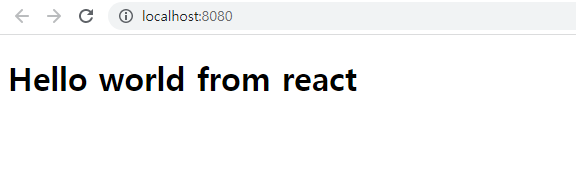

- `npm install react-native-web`

- webpack.config.js에 resolve 부분 코드 추가

  - ```
    const path = require('path');
    const HTMLWebpackPlugin = require('html-webpack-plugin');
    
    const HTMLWebpackPluginConfig = new HTMLWebpackPlugin({
      template: path.resolve(__dirname, './public/index.html'),
      filename: 'index.html',
      inject: 'body',
    });
    
    module.exports = {
      entry: path.join(__dirname, 'index.web.js'),
      output: {
        filename: 'bundle.js',
        path: path.join(__dirname, '/build'),
        },
        resolve: {
            alias: {
              'react-native$': 'react-native-web',
            },
          },
      module: {
        rules: [
          {
            test: /\.js$/,
            exclude: /node_modules\/(?!()\/).*/,
            use: {
              loader: 'babel-loader',
              options: {
                presets: ['@babel/preset-react'],
              },
            },
          },
        ],
      },
      plugins: [HTMLWebpackPluginConfig],
      devServer: {
        open: true,
        historyApiFallback: true,
    
        hot: true,
      },
    };
    
    ```

- App.web.js 파일 React Native 코드로 변경

  - ```
    import React from 'react';
    import {View, Text} from 'react-native';
    
    function App() {
      return (
        <View>
          <Text>Hello world from react</Text>
        </View>
      );
    }
    
    export default App;
    
    ```

- 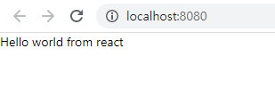


## 하나의 코드로 Web, Android 출력

- App.web.js -> App.js로 변경 후 App.js에 아래 코드로 변경

  - ```
    import React from "react";
    import { View, Text, StyleSheet } from "react-native";
    
    function App() {
      return (
        <View style={styles.container}>
          <Text>Hello world from react</Text>
        </View>
      );
    }
    
    const styles = StyleSheet.create({
      container: {
        flex: 1,
        justifyContent: "center",
        alignItems: "center",
      },
    });
    
    export default App;
    
    ```

- index.web.js에 `import App from './App.web'` -> `import App from './App'`로 변경


## TypeScript 적용

- https://reactnative.dev/docs/typescript

- `npm install -D @tsconfig/react-native @types/jest @types/react @types/react-test-renderer typescript`

- `npm install --save-dev typescript @babel/preset-typescript`

  - https://iamturns.com/typescript-babel/

- 타입스크립트 확장자가 ts, tsx이기에 webpack 설정 변경

  - ```
      resolve: {
        extensions: [".ts", ".tsx", ".js", ".json"],
        alias: {
          "react-native$": "react-native-web",
        },
      },
    ```

- babel.config.js 변경

  - ```
    module.exports = {
      presets: [
        'module:metro-react-native-babel-preset',
        '@babel/preset-react',
        '@babel/preset-typescript',
      ],
    };
    ```

- 테스트

  - root에 components 폴더 생성하고 TextItem.tsx 파일 생성

    - ```
      import React, { FC } from "react";
      import { View, Text } from "react-native";
      
      interface Props {
        text: string;
      }
      
      const TextItem: FC<Props> = ({ text }) => {
        return (
          <View>
            <Text>InServe</Text>
          </View>
        );
      };
      
      export default TextItem;
      ```

  - App.js를 App.tsx로 변경하고 아래코드로 수정

    - ```
      import React from "react";
      import { View, Text, StyleSheet } from "react-native";
      import TextItem from "./components/textItem";
      
      function App() {
        return (
          <View style={styles.container}>
            <TextItem text="Hello world from React Naitve Web" />
          </View>
        );
      }
      
      const styles = StyleSheet.create({
        container: {
          flex: 1,
          justifyContent: "center",
          alignItems: "center",
        },
      });
      
      export default App;
      ```

    - 


- 확장자 정리
  - **.js - native, web
  - **.web.js - web
  - **.native.js - native
  - **.ios.js - ios
  - **.android.js - android


## Styled Component 적용

- https://styled-components.com/docs/basics#react-native

- `npm install --save styled-components`

- `npm install --save-dev @types/styled-components @types/styled-components-react-native`

- TextItem.tsx에 적용

  - ```
    import React from "react";
    import { View, Text, StyleSheet } from "react-native";
    import TextItem from "./components/textItem";
    
    function App() {
      return (
        <View style={styles.container}>
          <TextItem text="Hello world from React Naitve Web" />
        </View>
      );
    }
    
    const styles = StyleSheet.create({
      container: {
        flex: 1,
        justifyContent: "center",
        alignItems: "center",
      },
    });
    
    export default App;
    ```

  - `Types: Could not find a declaration file for module 'styled-components/native'. ` 오류 발생 시

    - tsconfig.json에 아래 코드 추가

      - ```
        "types": ["react-native", "jest", "styled-components-react-native"]
        ```


# 프로젝트 생성 및 실행

## 프로젝트 생성

- `npx react-native init 프로젝트명`


## 안드로이드 실행

- `npm run android`


## Web 실행

- `npm run start-react`
